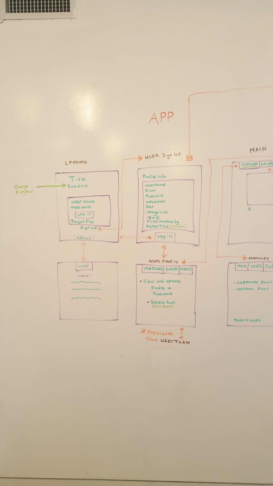
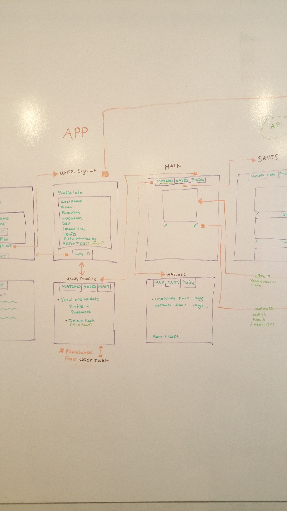
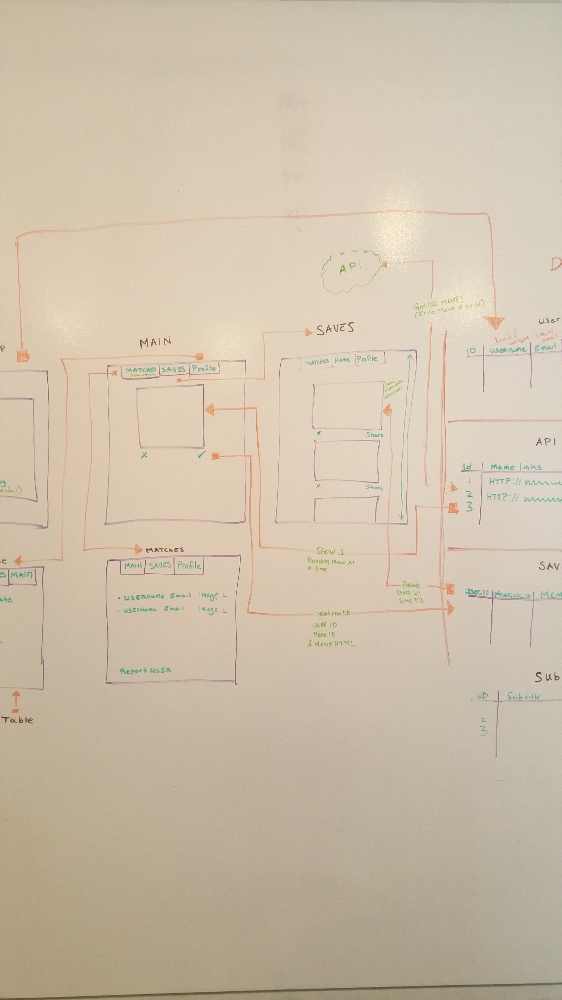
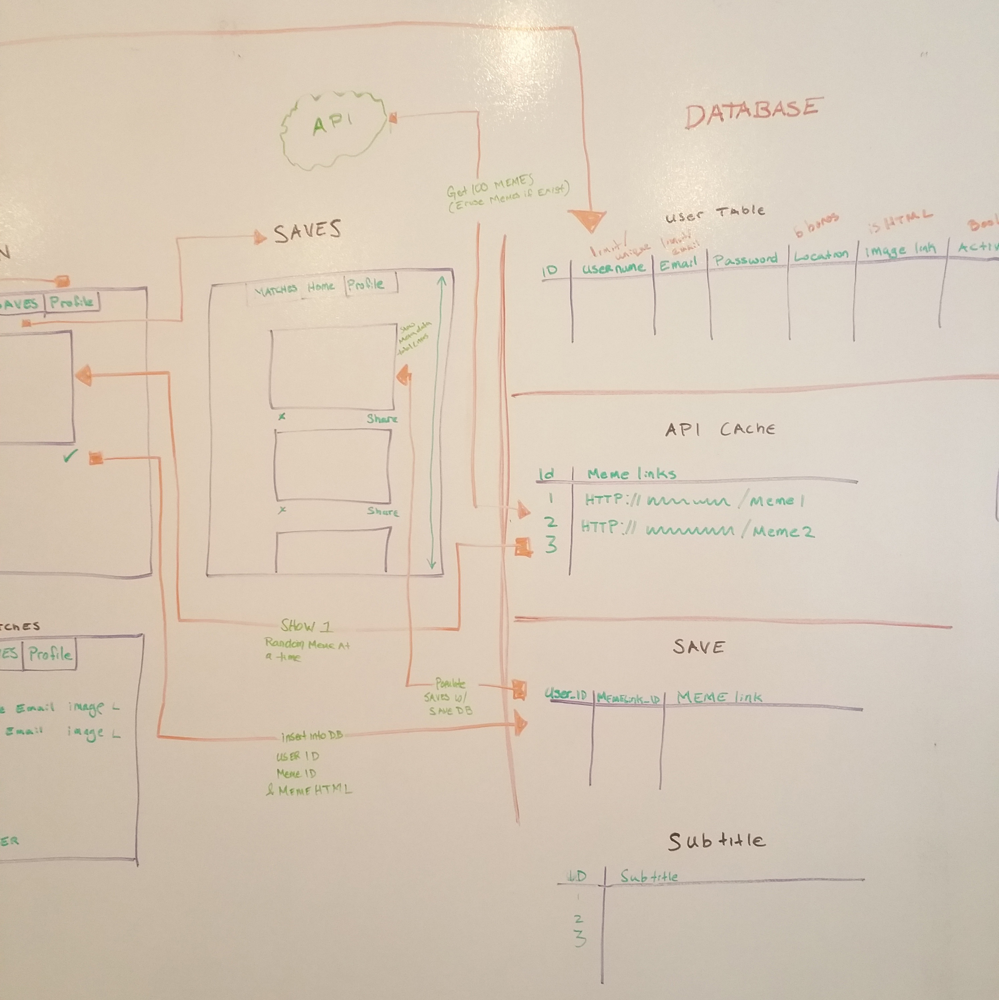
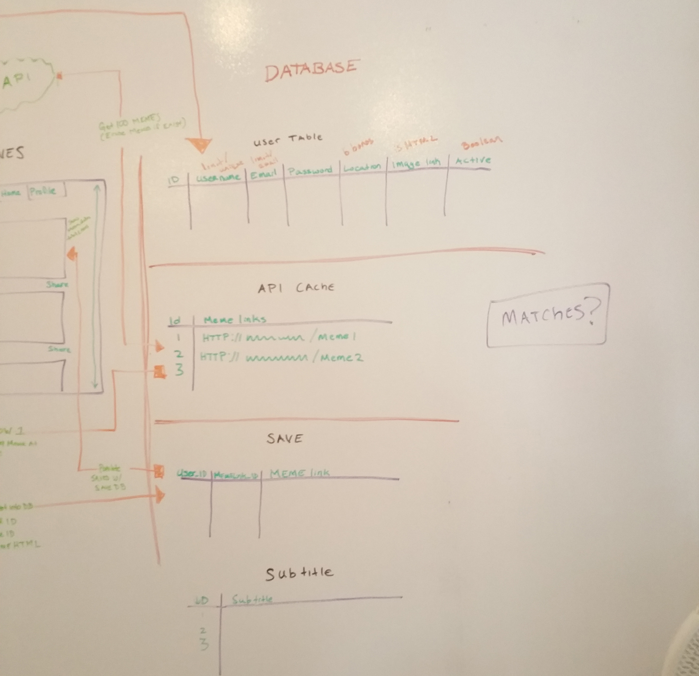

# Memedr
Memedr is a app that brings people together based on their choice of memes. A user is presented with a meme, they can choose if they like it or not. If they like a meme their choice goes into the database. After selecting a certain amount of memes(to be decided) they will be matched with another user who has liked a certain percentage of those same memes(also to be decided).

### CRUD FUNCTIONALITY
1. CREATE
    * User Profiles and Meme selections
2. READ
    * User Profiles and Meme selections
3. UPDATE
    * User Profiles
4. DELETE
    * User Profiles and Meme selections

### GITHUB PROJECTS/TRELLO

### API
1. Gify API
2. Meme API, etc..

### MVP
1. Theme
2. User Authentication
    * Update Profile
3. Database Schema
4. Matching Users

### TECHNOLOGIES USED
1. HTML/CSS/Javascript
2. Node.js
3. Express
4. PostgreSQL Databases
5. React.js
6. Postman for Endpoint testing

### DATABASE SCHEMA
1. psql -f /memedr-express/models/schema.sql

### NODE MODULES
1. Passport
    * To build a User System with authentication
    * Registration Form to store User's preferences
2. Axios (CRUD)
    * Library used to interact with the server. (send and receive information)
3. PG-Promise
    * Used to read SQL queries on Node
4. Logger
    * Terminal logger
5. Express Validator
    * Used to validate input from form submission
6. Body-Parser
    * Parse HTML and receive json object based on inputs on the server
7. DotENV
    * Allows .env support
8. bluebird
    * A promise library that is quick, easy to debug and full of features
9. Express
    * Used with Node.js
10. Path
    * Used to set up public folder for static files.
11. Express Session
    * Used to enable sessions, to track users activity and to keep users logged in.
12. CORS
    * Used to manage Cross Origin issues

### WIREFRAMES

### USER STORIES
1. As a user, I like to create an account to save my favorite GIFs.
2. As a user, I like to share my saved GIFs with friends and family.
3. As a user, I like to be able to change my username and password when needed.
4. As a user, I like to be matched with people who like similar GIFs.
5. As a user, I like to reset my password if I were to forget it.
6. As a user, I like to be able to like or dislike a GIF image when displayed.

### DOWNLOAD PROJECT & INSTALL
1. Git clone or download this project
2. Open up Terminal or Command line
3. Navigate to the directory where the project was cloned or downloaded to
4. Run this command: psql -f ../db/schema.sql
5. This command will create a PostgreSQL database along with the tables
6. To run the application, you need to install the dependencies, run this command: npm install --save
7. To start the application, run this command: npm start
8. The application will run at: localhost:3000, if that port is already in use, run this command: PORT=1738 npm start
9. This command will start the server at: localhost:1738

### AUTHORS
1. Eric
2. Gainor
3. Yamil